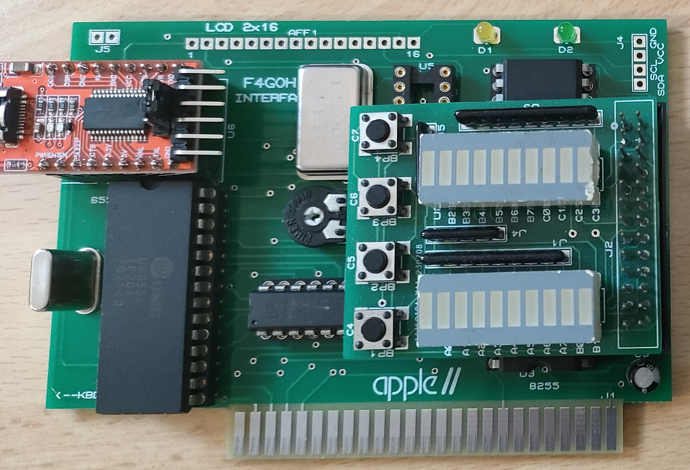
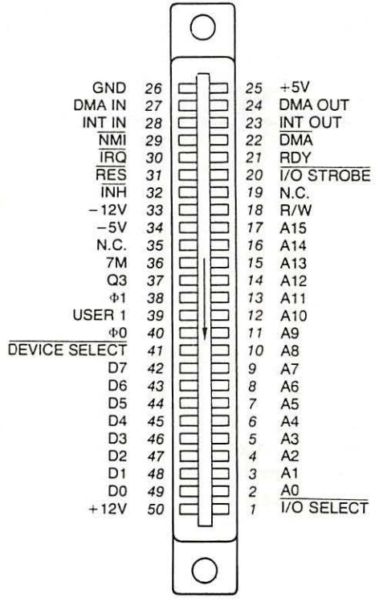
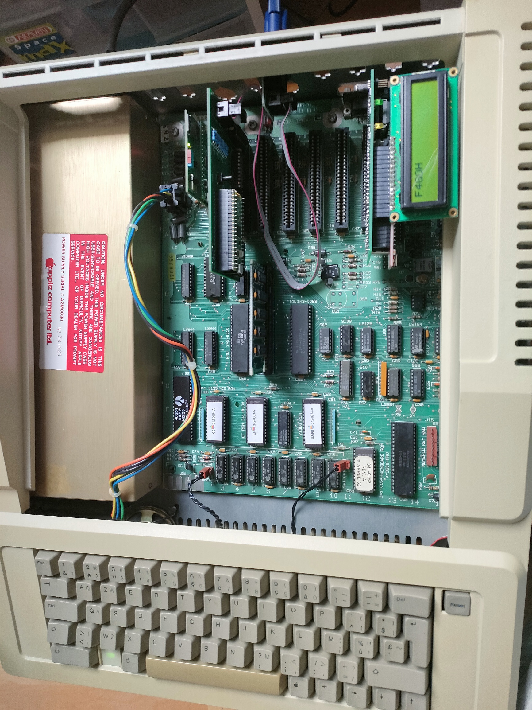
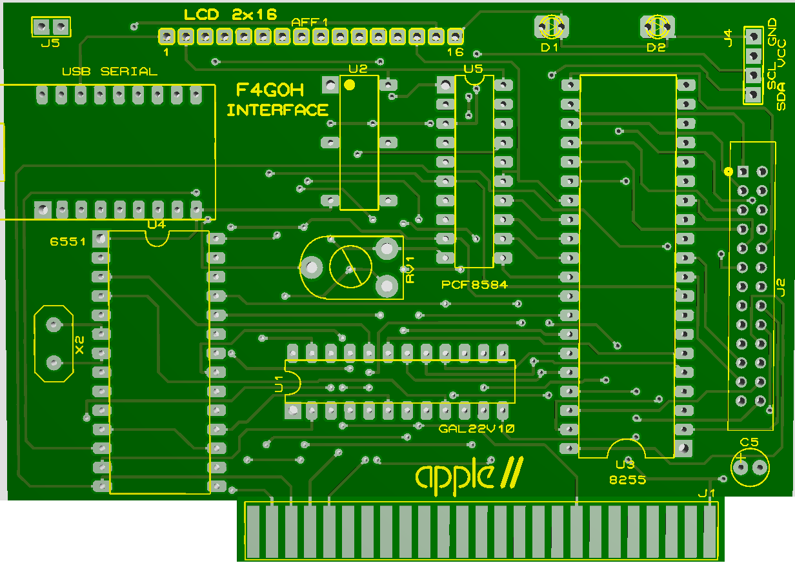

# Apple-IIe Expansion Card PIA ACIA I2C LCD and test leds




## Features:

- Address decoding GAL22V10
- PIA 8255
- UART 6551
- I2C PCF8584
- LCD 2x16

- GAL programming with [GALasm](https://github.com/daveho/GALasm) under linux.
- Programmer using is [XGECU - pro](https://www.aliexpress.com/premium/XGecu.html)

Example on slot 7
|Hexadecimal | Preripheral | Decimal Address |
| ------ | ------ | ------ |
|C0F0|	8255|	49392|
|C0F1|	8255|	49393|
|C0F2|	8255|	49394|
|C0F3|	8255|	49395|
|C0F4|	6551|	49396|
|C0F5|	6551|	49397|
|C0F6|	6551|	49398|
|C0F7|	6551|	49399|
|C0F8|	8584|	49400|
|C0F9|	8584|	49401|
|C0FA|	LCD|	49402|
|C0FB|	LCD|	49403|
|C0FC|	LED|	49404|
|C0FD|	free|	49405|
|C0FE|	free|	49406|
|C0FF|	free|	49407|







```c
Samples examples
```


